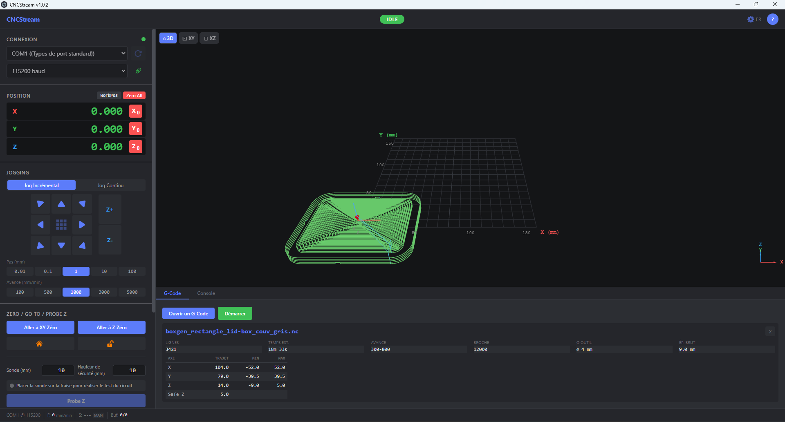
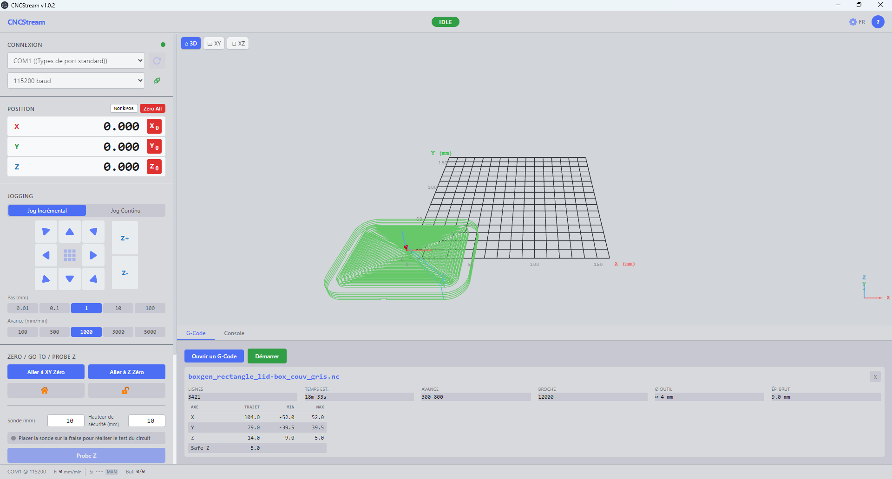

# CNCStream

**Contrôleur de machine CNC pour GRBL 1.1 et grblHAL**

Application de bureau construite avec **Electron**, **React** et **TypeScript**. Interface moderne, visualisation 3D temps réel, contrôle complet de la machine via liaison série.

> **Compatibilité grblHAL** : CNCStream supporte le protocole de base GRBL 1.1. En pratique, si grblHAL est configuré pour rester compatible GRBL 1.1 (ce qui est souvent le cas par défaut), CNCStream fonctionne normalement. Les fonctionnalités exclusives à grblHAL (commandes étendues, protocole JSON, etc.) ne sont pas prises en charge.

---

## Interface

| Mode sombre | Mode clair |
|---|---|
|  |  |

---

## Fonctionnalités

### Connexion série
- Détection automatique des ports COM disponibles
- Sélection du baud rate (115200 par défaut)
- Lecture automatique des paramètres GRBL (`$$`) à la connexion
- Indicateur d'état de connexion dans la barre de statut

### DRO — Digital Read-Out
- Affichage des positions sur **4 axes** : X, Y, Z, A (axe A activable dans les réglages)
- Bascule **MPos / WPos** (position machine / position de travail)
- Affichage du système de coordonnées de travail actif (G54 par défaut) — pour un usage ponctuel avec une seule pièce à la fois, G54 suffit
- Saisie directe de position par clic sur une valeur (commande `G10 L20`)
- Affichage **mm ou pouces** (conversion à l'affichage, la machine reste toujours en G21)

### Jogging
- Jog **incrémental** et **continu** (maintien de touche)
- Deux grilles de présets indépendantes selon l'unité (mm / pouces)
  - Pas mm : 0,01 · 0,1 · 1 · 10 · 100 mm
  - Pas pouces : 0,001 · 0,01 · 0,05 · 0,1 · 0,5 · 1,0 in
- Raccourcis clavier : flèches X/Y, Page Up/Down Z, `[` / `]` pour le pas
- Boutons A+ / A- pour l'axe rotatif (si activé)

### Zero / Go To
- **Go to XY Zero** : monte en Z (safe height), va à X0 Y0, redescend
- **Go to Z Zero** : descend Z à 0
- **Home** (`$H`) : cycle de homing complet
- **Unlock** (`$X`) : déverrouillage après alarme
- **Safe Height** : hauteur de dégagement configurable pour les déplacements et le probe

### Probe Z
- Détection automatique de la surface de la pièce via sonde de contact (circuit `Pn:P` GRBL)
- **Indicateur circuit** temps réel : ouvert (gris) / contact détecté (vert)
- Bouton Probe Z bloqué jusqu'à validation du circuit (sécurité par session)
- Descente à 50 mm/min (`G38.2 Z-20 F50`), remontée automatique au safe height après contact
- Champ épaisseur sonde configurable (0,1 à 50 mm)
- Boîte de confirmation avec option Appliquer / Annuler
- Application du zéro pièce Z (`G10 L20 P1`) en tenant compte de l'épaisseur sonde et du safe height

### Streaming G-Code
- Chargement de fichiers `.nc`, `.gcode`, `.tap`, `.ngc`
- Analyse du fichier : dimensions (min/max par axe), trajet total, temps estimé, outils, safe Z détecté
- Streaming ligne par ligne avec gestion du buffer RX GRBL (128 octets)
- **Start / Pause / Resume / Stop** (feed hold, cycle start, soft reset)
- Arrêt automatique de la broche à la pause et redémarrage avant les axes au resume (commande réaltime GRBL, tous modes)
- Barre de progression et temps restant estimé

### Visualiseur 3D
- Rendu Three.js (`@react-three/fiber`) du parcours outil
- Vert : mouvements d'usinage (G1) — Bleu pointillé : rapides (G0)
- Orange : lignes déjà exécutées — Cône rouge : position actuelle
- Navigation : rotation (clic gauche), zoom (molette), pan (clic droit)

### Overrides temps réel
- **Feed** : 10 % à 200 %
- **Rapid** : 25 %, 50 %, 100 %
- **Spindle** : 10 % à 200 % (mode PWM)
- Bouton Reset par override

### Broche (Spindle)
- Commandes M3 (CW), M4 (CCW), M5 (arrêt)
- Trois modes de contrôle :
  - **PWM** : vitesse pilotée par GRBL, overrides actifs
  - **Relais** : sortie ON/OFF, vitesse physique maximale
  - **Manuel** : potentiomètre physique externe, valeurs indicatives
- À la pause : arrêt automatique de la broche et des axes ; à la reprise : redémarrage de la broche avant les axes (tous modes)
- Badge mode visible dans le panneau, tooltip explicatif sur chaque mode

### Arrosage (Coolant)
- Flood `M8`, Mist `M7`, Stop `M9`

### Macros
- Macros prédéfinies (Carré test XY, Test axes, Retour origine XY) modifiables
- Création de macros personnalisées avec nom, description et séquence G-code multiligne
- Exécution via le mécanisme de streaming (Pause/Stop fonctionnels)
- Persistance locale (localStorage)

### Console GRBL
- Envoi de commandes GRBL manuelles
- Affichage des réponses machine (ok, error, alarm, status)
- Historique de session

### Référence intégrée
- Table des **erreurs GRBL** (error:1 à error:38)
- Table des **alarmes GRBL** (ALARM:1 à ALARM:11)
- Table des **paramètres GRBL** (`$$`) avec description et unité
- Raccourcis clavier

### Réglages
- Thème **clair / sombre**
- Unités **mm / pouces**
- Activation de l'**axe A**
- **Langue** : français / anglais (i18n react-i18next)

---

## Stack technique

| Couche | Technologie |
|---|---|
| Desktop | Electron 33 |
| UI | React 19 + TypeScript |
| Build | Vite / electron-vite |
| 3D | Three.js + @react-three/fiber |
| État | Zustand |
| Série | serialport 12 |
| i18n | i18next + react-i18next |

---

## Commandes de développement

### Mode développement
```bash
npm run dev
```
Lance Electron + HMR React simultanément.
`Ctrl+Shift+I` → DevTools — `Ctrl+R` → rechargement manuel.

### Build
```bash
npm run build
```
Génère les fichiers optimisés dans `/out`.

### Aperçu production
```bash
npm run preview
```
Lance la version `/out` comme si elle était installée (nécessite un build préalable).

### Installateur Windows
```bash
npm run package:win
```
Build + packaging electron-builder → crée le `.exe` dans `/dist`.

---

## Structure des sources

```
src/
├── main/               # Process principal Electron
│   ├── ipc/            # Gestionnaires IPC (commandes, probe, serial)
│   └── services/       # SerialPort, CommandQueue, MachineController
├── preload/            # Bridge IPC renderer ↔ main
├── renderer/src/
│   ├── components/     # Panneaux UI (DRO, Jog, Zero, Spindle, Macros…)
│   ├── stores/         # État global Zustand (machine, UI, connection)
│   ├── locales/        # Traductions EN / FR
│   └── assets/         # Icônes SVG
└── shared/             # Types et constantes partagés main/renderer
```
