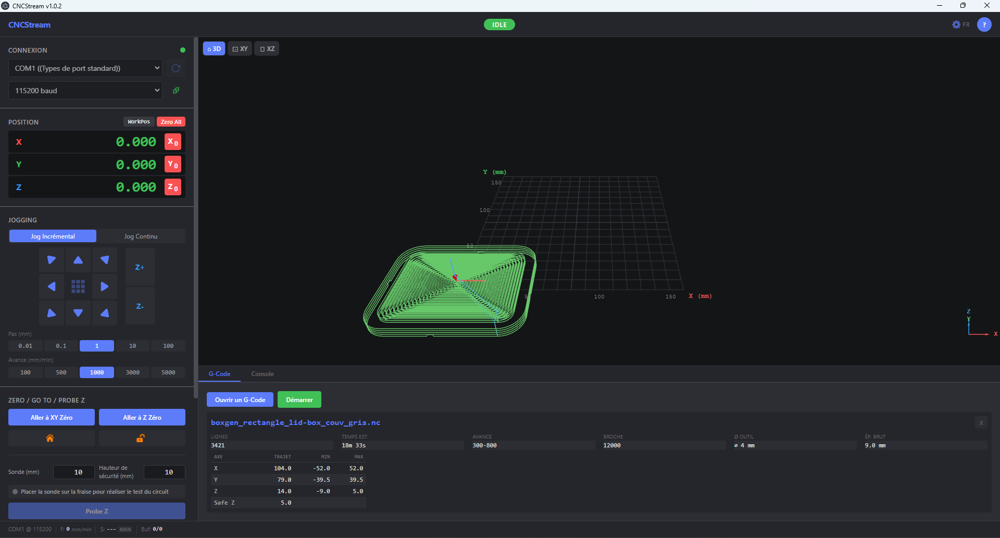
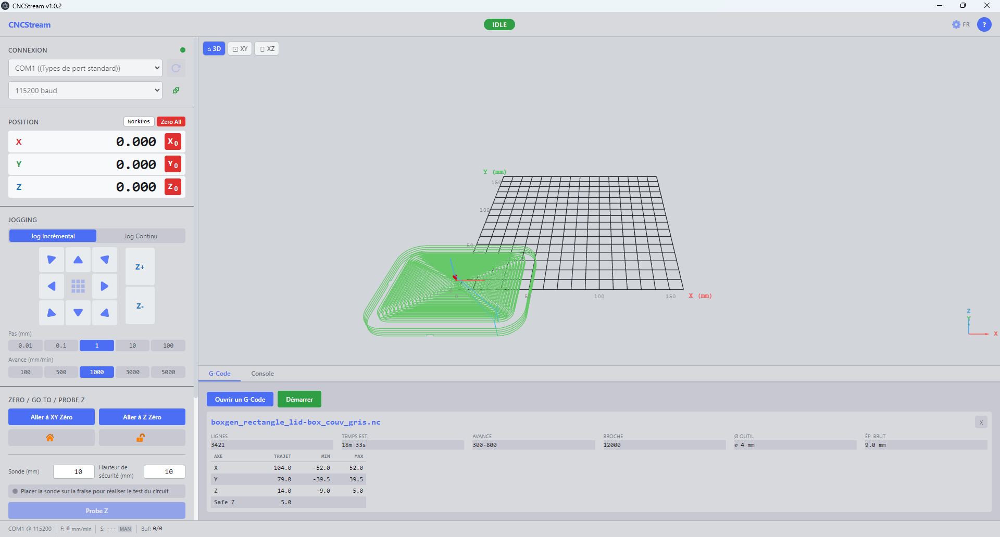

# CNCStream

**Contrôleur de machine CNC pour GRBL 1.1 et grblHAL**

Application de bureau construite avec **Electron**, **React** et **TypeScript**. Interface moderne, visualisation 3D temps réel, contrôle complet de la machine via liaison série.

> **Compatibilité grblHAL** : CNCStream supporte le protocole de base GRBL 1.1. En pratique, si grblHAL est configuré pour rester compatible GRBL 1.1 (ce qui est souvent le cas par défaut), CNCStream fonctionne normalement. Les fonctionnalités exclusives à grblHAL (commandes étendues, protocole JSON, etc.) ne sont pas prises en charge.

---

## Sécurité et tests avant utilisation

> **CNCStream est un logiciel de contrôle de machine-outil. Une mauvaise utilisation peut provoquer des blessures graves, des dommages matériels ou la destruction de la pièce usinée. Lire attentivement cette section avant toute mise en route.**

### Précautions générales

- Ne jamais laisser la machine sans surveillance pendant l'usinage
- Garder le bouton d'arrêt d'urgence (E-Stop) accessible à portée de main
- Porter les équipements de protection individuels adaptés (lunettes, protection auditive)
- S'assurer que la broche est **complètement arrêtée** avant de toucher la pièce ou l'outil
- Ne jamais désactiver les fins de course matériels

### Vérifications avant la première connexion

- [ ] Le câble USB est branché sur le contrôleur GRBL (pas sur la machine directement)
- [ ] Les fins de course sont câblés et fonctionnels (`$21=1` recommandé)
- [ ] La limite de déplacement logicielle est activée (`$20=1`) avec des valeurs cohérentes (`$130`, `$131`, `$132`)
- [ ] Le courant moteur est correctement réglé sur les drivers
- [ ] La broche est **arrêtée** et le variateur hors tension

### Tests à faire dans l'ordre

#### 1. Test de communication

Connecter CNCStream → vérifier la réception du statut GRBL dans la barre de connexion.
Envoyer `$$` dans la console → les paramètres doivent s'afficher.

#### 2. Test du homing (`$H`)

Effectuer le homing **sans outil** et **sans pièce** :
- S'assurer que la machine peut atteindre les fins de course sans obstacle
- Observer le sens de déplacement de chaque axe : doit aller vers les fins de course
- Après homing, MPos doit afficher `0.000` sur les axes homés

> Si la machine s'éloigne des fins de course, inverser le sens (`$3`) ou le câblage de la bobine.

#### 3. Test du jog

Tester le jog en incrémental petit pas (0,1 mm) sur chaque axe **à faible vitesse** :
- Vérifier que X+ déplace bien vers la droite (ou le sens attendu)
- Vérifier que Z+ monte bien (et Z- descend)
- Tester les fins de course en approchant lentement : la machine doit s'arrêter proprement

#### 4. Test du Probe Z

**Prérequis** : outil en place, sonde posée sur la pièce.
- Vérifier l'indicateur de circuit dans CNCStream : doit être **ouvert** (gris) au repos
- Toucher manuellement le dessus de la sonde avec l'outil → l'indicateur doit passer au **vert**
- Lancer le Probe Z en surveillant la descente : la broche doit descendre et s'arrêter au contact
- Si la machine remonte au lieu de descendre, vérifier le paramètre `$3` (masque d'inversion Z)

#### 5. Test de streaming (à vide)

Avant d'usiner une vraie pièce, effectuer un test **à vide** (broche arrêtée, outil relevé au safe height) :
- Charger un fichier G-code simple
- Vérifier les dimensions affichées dans l'analyse (min/max par axe)
- Lancer le streaming et surveiller le visualiseur 3D
- Tester Pause / Resume / Stop pendant l'exécution

#### 6. Premier usinage

- Commencer avec une matière tendre (bois, MDF) et des paramètres de coupe conservateurs
- Rester présent devant la machine, la main sur l'E-Stop
- Surveiller le bruit de coupe et la température de l'outil

### Paramètres GRBL recommandés

| Paramètre | Valeur | Description |
|---|---|---|
| `$20` | `1` | Soft limits activées |
| `$21` | `1` | Hard limits activées |
| `$22` | `1` | Homing activé |
| `$1` | `255` | Maintien moteurs actif (évite la perte de position) |

> Ces valeurs sont à adapter à votre machine. Consulter la documentation GRBL pour la signification complète de chaque paramètre (`$$` dans la console ou l'onglet Référence de CNCStream).

---

## Interface

| Mode sombre | Mode clair |
|---|---|
|  |  |

---

## Fonctionnalités

### Connexion série
- Détection automatique des ports COM disponibles
- Sélection du baud rate (115200 par défaut)
- Lecture automatique des paramètres GRBL (`$$`) à la connexion
- Indicateur d'état de connexion dans la barre de statut

### DRO — Digital Read-Out
- Affichage des positions sur **4 axes** : X, Y, Z, A (axe A activable dans les réglages)
- Bascule **MPos / WPos** (position machine / position de travail)
- Affichage du système de coordonnées de travail actif (G54 par défaut) — pour un usage ponctuel avec une seule pièce à la fois, G54 suffit
- Saisie directe de position par clic sur une valeur (commande `G10 L20`)
- Affichage **mm ou pouces** (conversion à l'affichage, la machine reste toujours en G21)

### Jogging
- Jog **incrémental** et **continu** (maintien de touche)
- Deux grilles de présets indépendantes selon l'unité (mm / pouces)
  - Pas mm : 0,01 · 0,1 · 1 · 10 · 100 mm
  - Pas pouces : 0,001 · 0,01 · 0,05 · 0,1 · 0,5 · 1,0 in
- Raccourcis clavier : flèches X/Y, Page Up/Down Z, `[` / `]` pour le pas
- Boutons A+ / A- pour l'axe rotatif (si activé)

### Zero / Go To
- **Go to XY Zero** : monte en Z (safe height), va à X0 Y0, redescend
- **Go to Z Zero** : descend Z à 0
- **Home** (`$H`) : cycle de homing complet
- **Unlock** (`$X`) : déverrouillage après alarme
- **Safe Height** : hauteur de dégagement configurable pour les déplacements et le probe

### Probe Z
- Détection automatique de la surface de la pièce via sonde de contact (circuit `Pn:P` GRBL)
- **Indicateur circuit** temps réel : ouvert (gris) / contact détecté (vert)
- Bouton Probe Z bloqué jusqu'à validation du circuit (sécurité par session)
- Descente à 50 mm/min (`G38.2 Z-20 F50`), remontée automatique au safe height après contact
- Champ épaisseur sonde configurable (0,1 à 50 mm)
- Boîte de confirmation avec option Appliquer / Annuler
- Application du zéro pièce Z (`G10 L20 P1`) en tenant compte de l'épaisseur sonde et du safe height

### Streaming G-Code
- Chargement de fichiers `.nc`, `.gcode`, `.tap`, `.ngc`
- Analyse du fichier : dimensions (min/max par axe), trajet total, temps estimé, outils, safe Z détecté
- Streaming ligne par ligne avec gestion du buffer RX GRBL (128 octets)
- **Start / Pause / Resume / Stop** (feed hold, cycle start, soft reset)
- Arrêt automatique de la broche à la pause et redémarrage avant les axes au resume (commande réaltime GRBL, tous modes)
- Barre de progression et temps restant estimé

### Visualiseur 3D
- Rendu Three.js (`@react-three/fiber`) du parcours outil
- Vert : mouvements d'usinage (G1) — Bleu pointillé : rapides (G0)
- Orange : lignes déjà exécutées — Cône rouge : position actuelle
- Navigation : rotation (clic gauche), zoom (molette), pan (clic droit)

### Overrides temps réel
- **Feed** : 10 % à 200 %
- **Rapid** : 25 %, 50 %, 100 %
- **Spindle** : 10 % à 200 % (mode PWM)
- Bouton Reset par override

### Broche (Spindle)
- Commandes M3 (CW), M4 (CCW), M5 (arrêt)
- Trois modes de contrôle :
  - **PWM** : vitesse pilotée par GRBL, overrides actifs
  - **Relais** : sortie ON/OFF, vitesse physique maximale
  - **Manuel** : potentiomètre physique externe, valeurs indicatives
- À la pause : arrêt automatique de la broche et des axes ; à la reprise : redémarrage de la broche avant les axes (tous modes)
- Badge mode visible dans le panneau, tooltip explicatif sur chaque mode

### Arrosage (Coolant)
- Flood `M8`, Mist `M7`, Stop `M9`

### Macros
- Macros prédéfinies (Carré test XY, Test axes, Retour origine XY) modifiables
- Création de macros personnalisées avec nom, description et séquence G-code multiligne
- Exécution via le mécanisme de streaming (Pause/Stop fonctionnels)
- Persistance locale (localStorage)

### Console GRBL
- Envoi de commandes GRBL manuelles
- Affichage des réponses machine (ok, error, alarm, status)
- Historique de session

### Référence intégrée
- Table des **erreurs GRBL** (error:1 à error:38)
- Table des **alarmes GRBL** (ALARM:1 à ALARM:11)
- Table des **paramètres GRBL** (`$$`) avec description et unité
- Raccourcis clavier

### Réglages
- Thème **clair / sombre**
- Unités **mm / pouces**
- Activation de l'**axe A**
- **Langue** : français / anglais (i18n react-i18next)

---

## Stack technique

| Couche | Technologie |
|---|---|
| Desktop | Electron 33 |
| UI | React 19 + TypeScript |
| Build | Vite / electron-vite |
| 3D | Three.js + @react-three/fiber |
| État | Zustand |
| Série | serialport 12 |
| i18n | i18next + react-i18next |

---

## Commandes de développement

### Mode développement
```bash
npm run dev
```
Lance Electron + HMR React simultanément.
`Ctrl+Shift+I` → DevTools — `Ctrl+R` → rechargement manuel.

### Build
```bash
npm run build
```
Génère les fichiers optimisés dans `/out`.

### Aperçu production
```bash
npm run preview
```
Lance la version `/out` comme si elle était installée (nécessite un build préalable).

### Installateur Windows
```bash
npm run package:win
```
Build + packaging electron-builder → crée le `.exe` dans `/dist`.

---

## Structure des sources

```
src/
├── main/               # Process principal Electron
│   ├── ipc/            # Gestionnaires IPC (commandes, probe, serial)
│   └── services/       # SerialPort, CommandQueue, MachineController
├── preload/            # Bridge IPC renderer ↔ main
├── renderer/src/
│   ├── components/     # Panneaux UI (DRO, Jog, Zero, Spindle, Macros…)
│   ├── stores/         # État global Zustand (machine, UI, connection)
│   ├── locales/        # Traductions EN / FR
│   └── assets/         # Icônes SVG
└── shared/             # Types et constantes partagés main/renderer
```

---

## Auteur

Développé avec l'assistance de l'IA [Claude](https://claude.ai) (Anthropic).

Contact : zebruo@gmail.com
